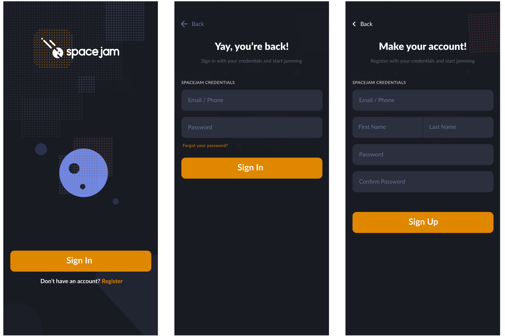

# Spacejam
A music sharing mobile application that allows users to create rooms and invite other users. Members of the room can queue music that will play through the host's speaker device. Likewise, members can also hear playback of the music on their own devices, but it will be synced with the host's current timestamp. This mobile application is being built in React Native with a Firebase backend and Redux for state management, following Redux Toolkit guidelines.

# Preview

SpaceJam MVP Notes (May 21, 2020)
____________________________________

(ROOM STUFF)

- Users can create rooms

- Users can join rooms

- Users can "enter/sign in to " rooms

- Users can leave rooms

- Users can delete rooms

-------------------------

(MUSIC STUFF)

- Users can search for music to add to a specific room

- Users can add music to a room

- Hosts can modify music in room

- Hosts can remove other users from a room

- Users can hear music for the room in which they are currently active (toggleable) Note: users can at any point (un)mute the audio for themselves without affecting the sync of the whole room

-------------------------

(USER STUFF)

- Users can create accounts

- Users can log in

- Users can log out

- Users can edit profile information once account is created

________________________________________________________
________________________________________________________
________________________________________________________
________________________________________________________

Data Models:
____________________________________

User Model:
{
	"firstName": "",
	"lastName": "",
	"email": "", // unique id
	"password": "",
	"ownedRooms": [],
	"guestRooms": [],
	"activeRoom": "" // unique room id from either rooms[]
}

Room Model:
{
	"roomId": longassrandomint,
	"roomName": "",
	"inviteCode": shortrandomint,
	"host": "", // unique id of user
	"guests": [], // list of unique ids of users
	"songs": [], // list of songs in spotify, to be triggered in sequence, when a song starts playing (from songs[0], it gets popped off into currentSong)
	"currentSong": "",
	"currentTimecode": "",
	"isPlaying": boolean,
	"isActive": boolean,
	"currentTimecode": ""
}

________________________________________________________
________________________________________________________
________________________________________________________
________________________________________________________

Music Sync Process:
When host plays/pauses music, push play/pause notification to all guests and play/pause accordingly (at timecode included in notification). Same deal on song change and timecode update.
